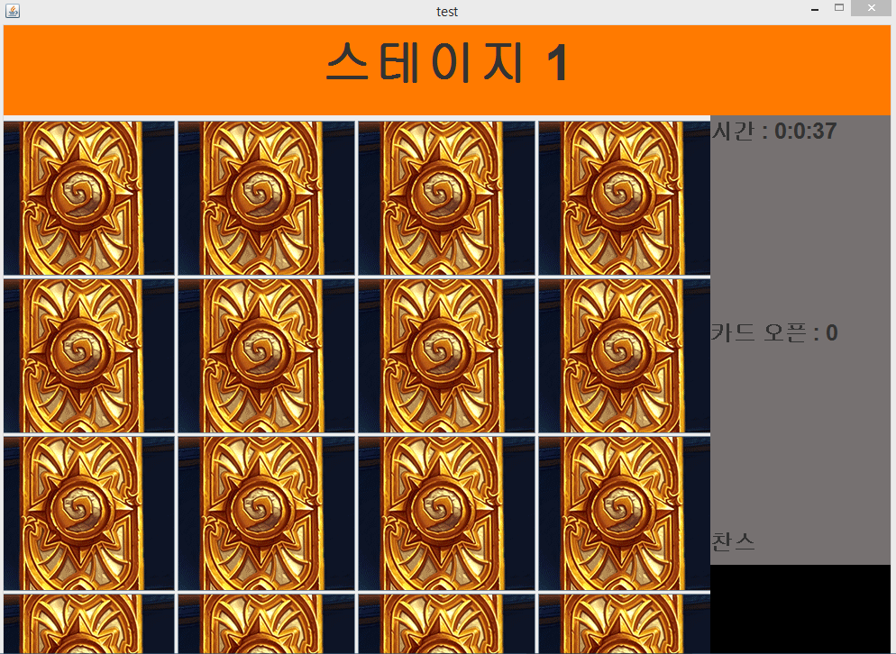
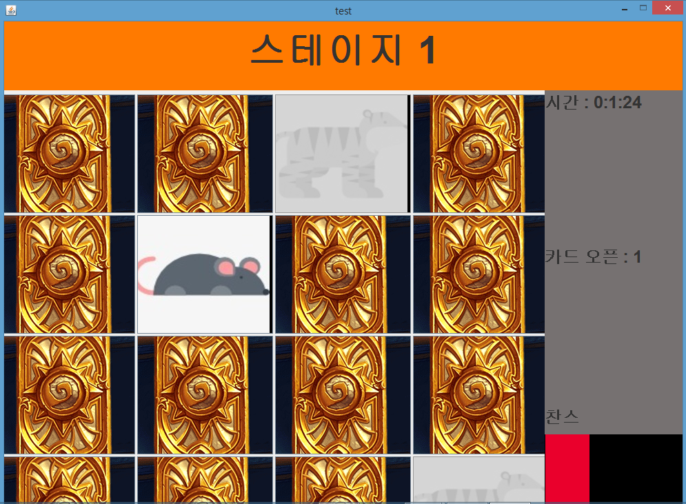
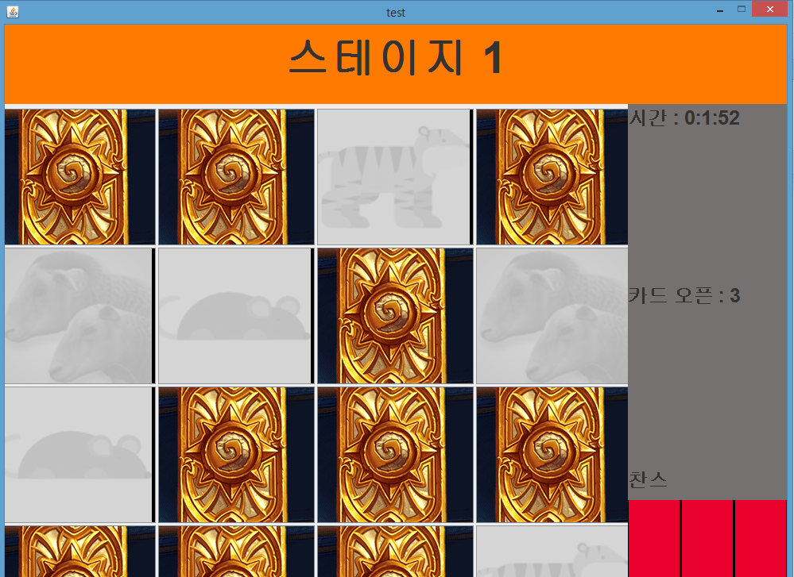
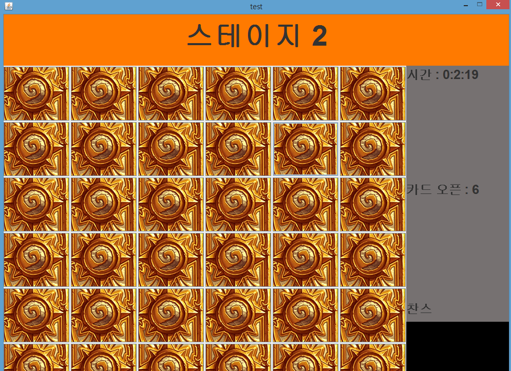

# Card_Game_by_java

## Screenshot

## Stage 1
4 * 4 の16枚のカード
同じ絵のカードをクリッしてカードを除く

## Stage 2
6 * 6 の36枚のカード

## Chance
3連続カードを除いたらChanceを得ます。
右下段で今何連続でカードを除いるのか確認できます（ピンクいろのブロックで表示されます）
3連続で除いたらブロックが瞬きます。
